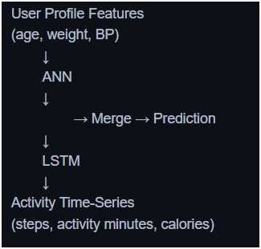
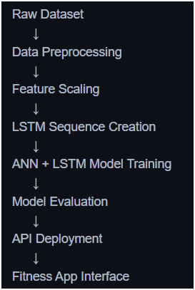
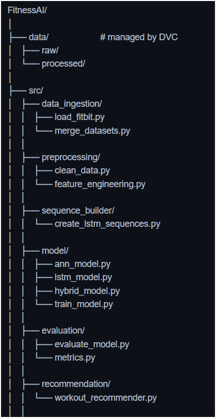
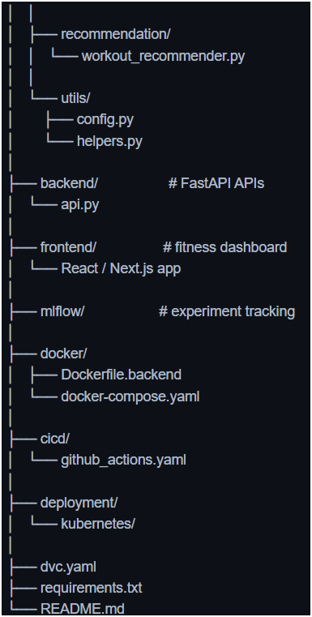

# 🏋️SmartFitness-AI

An **AI-powered fitness assistant** that analyzes user health data and activity history to predict fitness level, estimate calories burned, and generate personalized workout recommendations with interactive 3D exercise guidance.

---

    

---

## 🧾Project Overview

The system uses a **hybrid deep learning model (ANN + LSTM)** to analyze:

* user profile data (*age, weight, body fat, blood pressure*)
* daily activity data (*steps, active minutes, calories*)

**Based on this analysis, the system can:**

* predict fitness level
* estimate calorie burn
* generate personalized exercise recommendations
* provide 3D workout visualization
* track user fitness progress

## 💡Key Features

### 1️⃣ Health Prediction (ANN + LSTM)

The hybrid model analyzes both:

* static health features
* time-series activity patterns

to predict the user's  **fitness class or health condition** .

---

### 2️⃣ Calorie Burn Estimation

The system estimates the number of calories burned based on:

* daily steps
* activity intensity
* user body metrics

---

### 3️⃣ Personalized Workout Generator

Based on the predicted fitness level, the system generates:

* daily workout plans
* recommended activity goals
* exercise intensity suggestions

---

### 4️⃣ 3D Exercise Visualization

The platform provides **interactive 3D exercise demonstrations** to guide users in performing workouts correctly.

Technologies used may include:

* **Three.js**
* **Blender**

---

### 5️⃣ Camera-Based Posture Detection

Using computer vision, the system detects exercise posture and provides real-time feedback to improve workout form.

Possible tools:

* **MediaPipe**
* **OpenPose**

---

### 6️⃣ Progress Tracking Dashboard

Users can track:

* daily steps
* calories burned
* activity levels
* fitness score trends

---

## 🚀Model Architecture

---

## 🧠Technology Stack

#### Data Collection

The system uses a dataset that includes:

**-Activity Data.**

**-Health Profile Data.**

#### Data Preprocessing

Before training the model, the dataset undergoes preprocessing steps.Hybrid Model Architecture

##### Machine Learning/Deep Learnig

###### ANN & LSTM

**ANN**-Static user information.

**LSTM**-Time-series patterns.

* TensorFlow / Keras
* Scikit-learn
* Pandas

#### Model Training

The model is trained using:

* **TensorFlow / Keras**
* **Adam optimizer**
* **Sparse categorical crossentropy loss**

**MLOps**

* **DVC** for dataset versioning
* **MLflow** for experiment tracking

**Backend**

* FastAPI

**Frontend**

* React

**Deployment**

* Docker
* Kubernetes

**Cloud Storage**

* Amazon S3 Bucket

---

## 💎Project Pipeline

---

## ⚙️Tech Stack

| Category              | Technology                                                  | Purpose                                           |
| --------------------- | ----------------------------------------------------------- | ------------------------------------------------- |
| AI / Machine Learning | **TensorFlow**,**Keras**,**Scikit-learn** | Build and train ANN + LSTM models                 |
| Data Processing       | **Pandas**,**NumPy**                            | Data cleaning, preprocessing, feature engineering |
| Backend               | **FastAPI**,**Uvicorn**                         | API development and model serving                 |
| Frontend              | **React**,**Next.js**                           | User interface and dashboard                      |
| Computer Vision       | **MediaPipe**,**OpenCV**                        | Exercise posture detection                        |
| 3D Visualization      | **Three.js**,**Blender**                        | 3D exercise demonstration                         |
| MLOps                 | **DVC**,**MLflow**                              | Data versioning and experiment tracking           |
| Cloud Storage         | **Amazon S3**                                         | Store datasets and trained models                 |
| Deployment            | **Docker**,**Kubernetes**                       | Containerization and scalable deployment          |

---

## 🧰SmartFitness-AI Project Architecture

